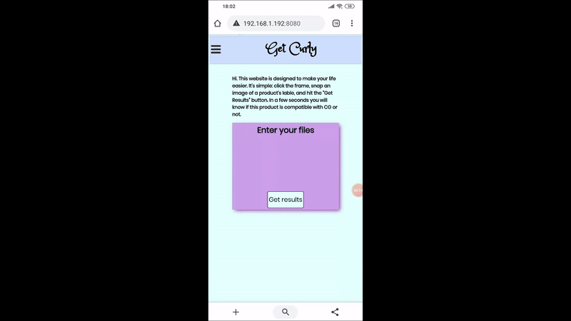
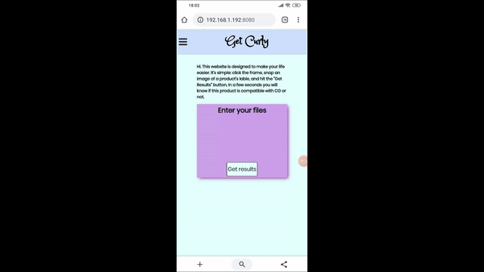
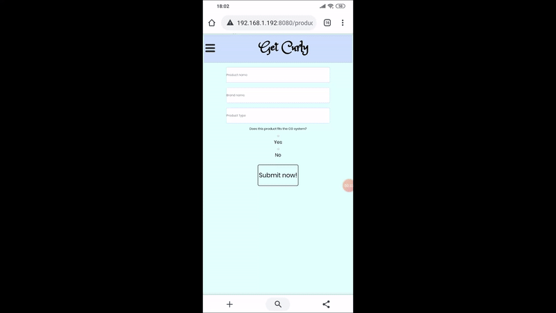
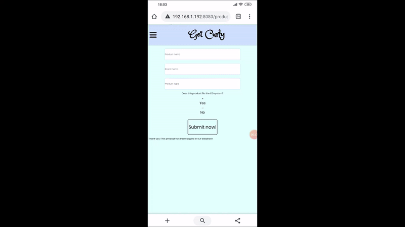

# Get Curly
A mobile app which reads a hair product's label and lets you know if this product is usable with the "Curly Girl" hair care method by parsing the lable using OCR technology. Based on Google Vision API.

## Demo:

When user uploads a label to the app, they get back an answer from the server.

For example, here's what happens when user uploads a lable of a products they **shouldn't** use:

And when they upload a product they **should** use:

The user can **add products** to the database:

And **search the database** as well:

## Future features:

There will be a *user section*, where user can create their own *favorite list*. They will be able to select the favorite directy from the search option.

In addition there will be an *explanation about each substance* and why it's labled as acceptable/unacceptable. 

